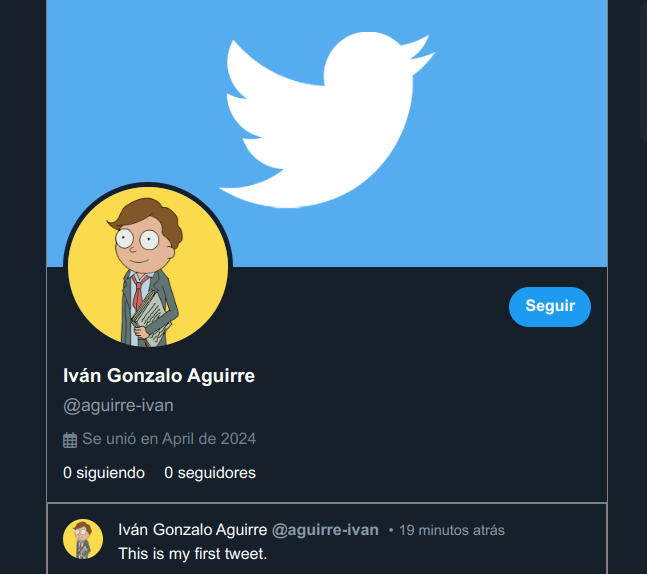

# Mini Twitter Clone

## Description

Mini Twitter Clone is a project that replicates the basic functionalities of Twitter. Users can create tweets, follow other users, and view a feed of tweets.

This project was developed after completing a PHP and MySQL course at [Education IT](https://www.educacionit.com/) academy.

### Technologies Used

This project is built with PHP, MySQL, HTML, Sass.

Additionally, it utilizes Docker and Docker Compose for setting up and running the application environment.

## Installation

To install and run this project, follow these steps:

1. Clone the repository
2. Navigate to the project directory:

```
cd mini-twitter-clone
```

3. Start the server:

```
docker compose up -d
```

The necessary database for running the project is set up using an SQL script located in docker-config/database/init/.

Make sure to give permissions to `www-data:www-data` for `/public/files/` directory.

## Usage

Once the server is up and running, you can access the web application at `http://localhost`.

## Preview



## Contribution

Contributions are welcome. Please open an issue to discuss what you would like to change or submit a pull request.
